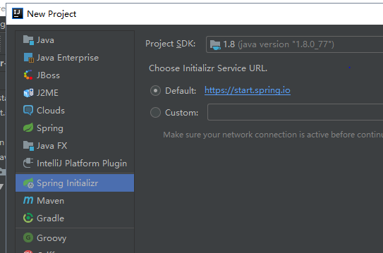
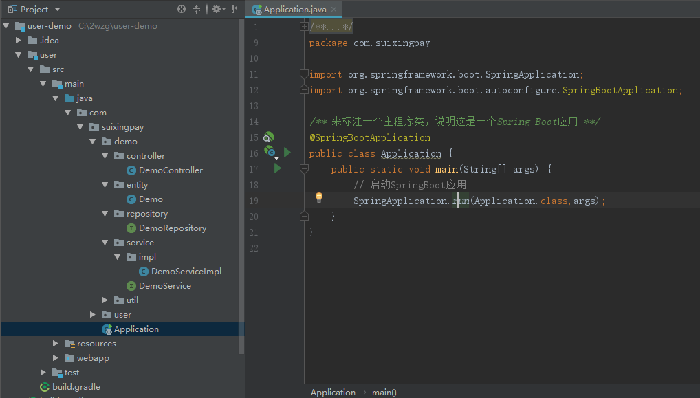
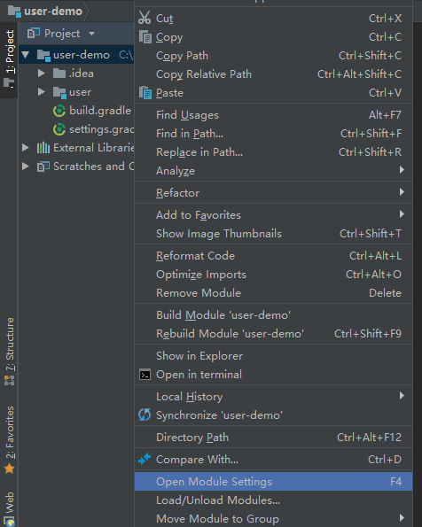
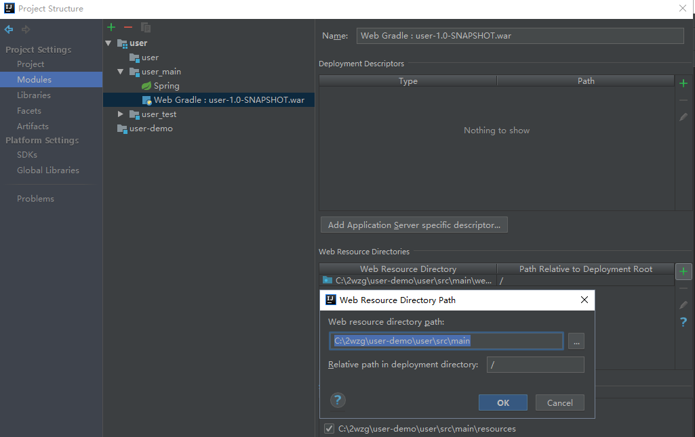
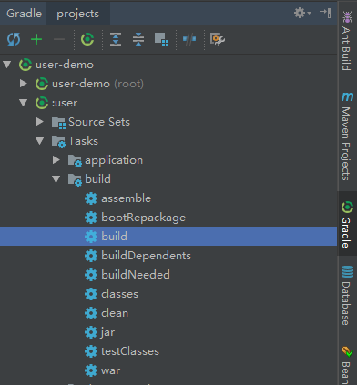
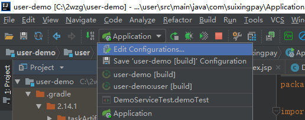
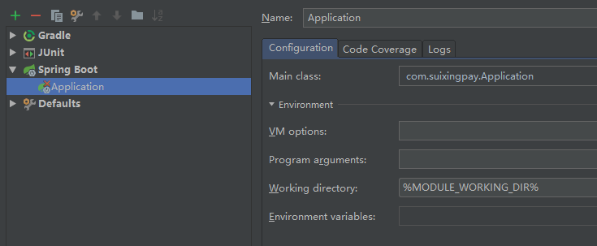

# [SpingBoot](https://shimo.im/docs/UAPIAL6S2A4L8FSC)
## 1、简单介绍

* SpingBoot是简化Spring的框架、整和Spring技术栈的一站式解决方案。
* 它是一种微服务架构，约定大于配置、抛弃了繁琐的xml配置过程，采用大量的注解简化开发过程。SpringBoot实现了自动配置，降低了项目搭建的复杂度。
* SpingBoot的特性：快速创建Spring应用、内嵌Tomcat、约定大于配置、提供starter简化Maven配置、提供程序的健康检查等功能。
* SpringBoot值得学习的地方：YAML语法、多Profile文件、自动配置原理、自定义注解、模板引擎、国际化、错误处理机制、Docker、整合Mybatis(JPA)、自定义starter等...

## 2、快速入门

* 这里以IDEA演示。以新建一个Gradle(或者Maven)的用户系统为例，也可以选择Spring Initializr快速创建项目。

  

* 本书选择新建一个gradle空项目user-demo、然后新建一个gradle jave的子模块user。新建完后在build.gradle中配置好仓库地址、然后添加相关的依赖（这里以一个web项目举例）。
* 本书项目示例已上传到GitHub  [阿里仓库版项目地址为](https://github.com/wufa995/user-demo.git) https://github.com/wufa995/user-demo.git

```java
// 以下依赖都是网络寻找，推荐使用公司私服版本
dependencies {
    // spring-boot-web 相关的依赖
    compile('org.springframework.boot:spring-boot-starter-web')
    // spring-boot-test 测试相关的依赖
    testCompile('org.springframework.boot:spring-boot-starter-test')
}
```



* 再创建出如图所示的目录结构、在指定位置新建Application.java，一定要注意它的位置。
* 以及在resources包下新建一个application.yml（或application.properties）文件。它用来写springboot的相关配置，yml方式比较常用。因为语法比较简短、方便阅读，值得注意的是、yml配置中的每一级都必须竖向对齐、否则会引发错误。

> 包下的结构：如果有多个子代码模块（例如demo、user)，建议将Application.java放在与他们同级(或上级）的位置上，一定要保证controller、service等包内的文件在Application.java的下一层。这样springboot配置才会默认生效。

* 在Application.java中写入如下代码。

```java
/** 来标注一个主程序类，说明这是一个Spring Boot应用 **/
@SpringBootApplication
public class Application {
    public static void main(String[] args) {
        // 启动SpringBoot应用
        SpringApplication.run(Application.class,args);
    }
}
```

* 这样一个简单的springboot应用就搭建好了。由于一个web项目还需要整合许多的配置。接下来就继续在这个项目里整合出用户系统的模板引擎。

* 整合Mybatis，继续在build.gradle中添加依赖。

```java
// 使用mybatis框架需要的依赖
compile 'org.mybatis.spring.boot:mybatis-spring-boot-starter:1.3.0'
// 简化实体类开发的工具、包含Slf日志框架
compile('org.projectlombok:lombok')
// mysql的连接驱动
compile 'mysql:mysql-connector-java'
```

* 开始配置Mybatis相关的配置，需要设置好连接数据库的url、用户名、密码等...还需要设置 *Repository.xml(*Mapper.xml)的路径等配置。

```yml
# Mybatis简单配置
mybatis:
  # 配置xml的路径，在任意位置都识别*Repository*.xml的路径
  mapper-locations: classpath:repository/**/*Repository*.xml
  configuration:
    # 查询SQL的超时时间5秒
    default-statement-timeout: 5
# 配置日志打印级别
logging:
   level:
     # repository类所在的包路径：级别
     com.suixingpay.demo.repository: DEBUG
spring:
  # 配置数据源
  datasource:
    url: jdbc:mysql://localhost:3309/xinghuo?characterEncoding=utf8&useSSL=false&autoReconnect=false&rewriteBatchedStatements=true
    username: root
    password: root
```

* 在Application.java中需要添加@MapperScan(repository的包路径)

```java
/** MapperScan **/
@SpringBootApplication
@MapperScan("com.suixingpay.demo.repository")
public class Application {...}
```

* 配置完成，可以通过以往所学验证是否连接成功。接下来整合使用jsp，添加如下依赖

```java
// 支持web mvc
compileOnly "org.springframework:spring-webmvc"
// 支持servlet
compileOnly "javax.servlet:javax.servlet-api"
// tomcat相关的依赖
compile("org.springframework.boot:spring-boot-starter-tomcat")
// 支持JSP的依赖
compile ("org.apache.tomcat.embed:tomcat-embed-jasper")
// 支持jstl的依赖
compile("jstl:jstl:1.2")
```

在user模块src -> main 目录下新建一个目录（directory），取名为webapp(或webRoot)，在其中创建如图所示的结构。


* 在index.jsp中写入代码。在controller中写入相应的跳转方法。

```jsp
<%@ page contentType="text/html;charset=UTF-8" language="java" %>
<%@ taglib uri="http://java.sun.com/jsp/jstl/core" prefix="c"%>
<%@ taglib uri="http://java.sun.com/jsp/jstl/core" prefix="fmt"%>
<%@ taglib uri="http://java.sun.com/jsp/jstl/functions" prefix="fn"%>
<html>
<head>
    <title>测试JSP</title>
</head>
<body>
  ${test}
</body>
</html>
```

```java
@GetMapping("/test")
public String test(Model model){
    model.addAttribute("test", "测试JSP");
    return "index";
}
```

* SpringBoot支持@RestController注解，@RestController 等同于 @ResponseBody + @Controller。
* 但如果使用的是JSP、就不要在Controller类上标注@ResponseBody了，@Controller即可。
* 在application.yml中写入配置。

```yml
spring:
  mvc:
    view:
    # 设置访问页面的后缀
    suffix: .jsp
    # 设置访问页面的前缀
    prefix: /WEB-INF/jsp/
```

* 要注意在同一个yml配置里，spring: 开头的只允许有一个，需要在之前的spring:中继续写。mvc:与datasource:属于同一级。

* 虽然新建了webapp目录，但是并没有被idea所识别为web目录。还需要进行配置。



* 进入后找到user-main模块下，点击Web，在点击右下方的加号、将地址设置为webapp的目录地址。点击OK。



* JSP的配置完成了。接下来测试访问/test接口，查看是否跳转到jsp页面。因为idea对jsp的支持有很多问题。可以先将项目打成jar（或war)包，再进行测试。如果用java -jar的方式启动能够跳转到jsp页面，说明配置已成功，可能需要手动去改idea的一些相关配置。
* 下面介绍打包的方法

```java
// apply plugin: 'war'
apply plugin: 'java'
apply plugin: 'eclipse'
apply plugin: 'org.springframework.boot'
group 'suixingpay-usersystem'
version '1.0-SNAPSHOT'
```
* 在build.gradle中找到大概上面所写的位置，加入一行 apply plugin: 'war'，就设置为打war包。

* 然后再通过idea右侧的gradle工具，选中对应模块下的Tasks -> build -> build进行打包。



* 如果不加 apply plugin: 'war' 这一行，默认打出的是jar包。
* 如果使用idea启动时跳转jsp页面时出现了404等问题，可以进行如下尝试。





* 在Spring Boot下的Application里设置Working directory为%MODULE_WORKING_DIR%
* 如果一切顺利，就可以通过springboot使用熟悉的SSM框架进行开发了。
* 在开发过程中、可以整合很多工具进行辅助开发，首先是lombok（之前已经引入过依赖）。
* 项目首次使用需要设置Enable Annotation Processing。位置在File -> Settings -> Build... -> Compiler -> Annotation Processors


```java
import lombok.AllArgsConstructor;
import lombok.Data;
import lombok.NoArgsConstructor;
/**
 * Data ： 生成getter、setter、equals、hashcode、toString方法
 * NoArgsConstructor ：生成无参构造方法
 * AllArgsConstructor ： 生成全参数构造方法
 */
@Data
@NoArgsConstructor
@AllArgsConstructor
public class Demo {

  /** 主键 **/
  private String id;
  /** 用户名 **/
  private String userName;
  /** 密码 **/
  private String password;
  /** 角色/身份 **/
  private String role;
  /** 删除【0：未删除、1：已删除】**/
  private long isDelete;
}
```

* 然后是swagger、可以在网页中生成接口文档、后端还可以通过它来验证接口是否好用（也可以使用Postman等工具）依赖如下

```java
// 一款API文档相关的框架、后端可用来测试接口
compile 'com.spring4all:swagger-spring-boot-starter:1.8.0.RELEASE'
```

>使用swaager2时需要在Application.java类的上方标注@EnableSwagger2
>
>```java
>@EnableSwagger2
>@SpringBootApplication
>@MapperScan("com.suixingpay.demo.repository")
>public class Application {...}
>```
>
>在controller类上方标注@Api(description = "该controllerAPI的描述")
>
>在方法上方标注@ApiOperation(...)
>
>```java
>@GetMapping("/demo")
>@ApiOperation(value = "这里输入接口名称", notes = "# 这里支持MarkerDown语法，描述接口")
>```
>
>然后运行程序，然后访问http://localhost:端口号/[项目路径/]swagger-ui.html#/
>

* 如果使用Maven新建该项目、不同之处也只是在配置依赖上。可以通过该网站搜索获取相关的依赖：
* [网站](https://mvnrepository.com/)： https://mvnrepository.com/
* 在模板引擎中还会更多的SpringBoot的样例、仅提供学习参考。
* 最后推荐两个idea比较常用的插件
  1. MyBatisX ：能够快速转到映射的xml文件的位置
  2. Alibaba Java Coding Guidelines ：能够自动分析代码是否书写规范

## 3、配置详解

* 首先介绍yml的基础配置，yml是以空格的缩进来控制层级关系；只要是左对齐的一列数据，都是同一个层级的。属性和值大小写敏感。
* 字符串默认不用加上单引号或者双引号。双引号不会转义字符串里面的特殊字符；单引号会转义。

```yml
server:
 # 配置端口为8080
 port: 8080
 # 配置项目路径
 context-path: /user
# 测试从配置文件中获取值的示例，下面以demo为例
demo:
  # 支持使用占位符生成随机数 ${random.value}、${random.int}、${random.long}...
  # @Value("${random.uuid}")里也可以用
  id: ${random.uuid}
  userName: root
  password: ${demo.userName}asd123
  test: 测试从配置文件中获取值
  version: 1
# yml数组的写法
listName:
  ‐ obj1
  ‐ obj2
  ‐ obj3
# 数组的简略写法
# listName: [obj1,obj2,obj3]

```

* 从application.yml文件中取值的两种方法：

1. 使用@Value注解，demo包下可使用。

   ```
   @Value("${demo.test}")
   private String test;
   @Value("${demo.version}")
   private Integer version;
   ```

2. 通过在实体类上加如下两个注解，可以直接将数据映射到对象中。使用的时候只要注入实体类就可以了。

   需要引入依赖。

   ```
   // 导入配置文件处理器，配置文件进行绑定就会有提示
   compile group: 'org.springframework.boot', name: 'spring-boot-configuration-processor', version: '1.5.17.RELEASE'
   ```

   ```
   @Component
   @ConfigurationProperties(prefix = "demo")
   public class Demo {Integer id; String userName; String password; ...}
   ```

* application.yml 和  application.properties都可以用来书写SprinBoot的相关配置。
* application.properties格式的写法如下：

```java
server.port=8080
server.context-path=/user
demo.id=1
demo.userName=aaa
demo.password=asd123
demo.test=测试从配置文件中获取值
demo.version=1
list=‐ obj1 ‐ obj2 ‐ obj3
logging.level.com.suixingpay.demo.repository=DEBUG
spring.datasource.url=jdbc:mysql://localhost:3309/xinghuo?characterEncoding=utf8&useSSL=false&autoReconnect=false&rewriteBatchedStatements=true
spring.datasource.username=root
spring.datasource.password=root
spring.mvc.suffix=.jsp
spring.mvc.prefix=/WEB-INF/jsp/
spring.application.name=user-demo
```

* [该网址可以在线转化这两种格式](http://www.toyaml.com/index.html) http://www.toyaml.com/index.html

* 多Profile文件(多个配置文件)的用法
* 我们在主配置文件编写的时候，文件名可以是 application-{profile}.yml/properties
  默认使用application.properties的配置；
* yml支持多文档块，这样可以使开发环境、RC环境、测试环境、生产环境等可以有不能的配置。例如不同的数据源、MQ、Redis、Eureka地址等。

```yml
server:
  port: 8081
spring:
  profiles:
  # 激活指定profile
  active: prod
‐‐‐
server:
  port: 8083
spring:
  # 开发环境的配置
  profiles: dev
‐‐‐
server:
  port: 8084
spring:
  # 生产环境的配置
  profiles: prod
```

* 学会SpringBoot特别重要的就是灵活使用注解。自己学会自定义注解，更能理解很多其中的原理。
* 读者学会之后尝试自己实现一个@IsAdmin("admin")注解，标注在方法上。只有数据库内身份是管理员才有权限调用这个方法。

## 4、健康检查

1. 添加依赖

```java
// SpringBoot 项目健康检查与监控
compile group: 'org.springframework.boot', name: 'spring-boot-starter-actuator', version: '1.5.17.RELEASE'
```

2. 配置yml

```yml
management:
  # 设置监听端口，不设置与server.port一致
  port: 8080
  health:
    db:
      enabled: true
    mail:
      enabled: true
  # 指定访问信息不进行用户验证，true可能会出现401
  security:
    enabled: false
```

3. 简单介绍以下接口，可通过HTTP GET请求访问。

   /autoconfig : 查看自动配置的使用情况

   /configprops : 查看配置属性

   /beans : 查看bean及其关系列表

   /dump : 打印线程栈

   /env : 查看所有环境变量

   /health : 查看应用健康指标

   /mappings : 查看所有url映射

   /metrics : 查看应用基本指标

   /trace : 查看基本追踪信息

   ...